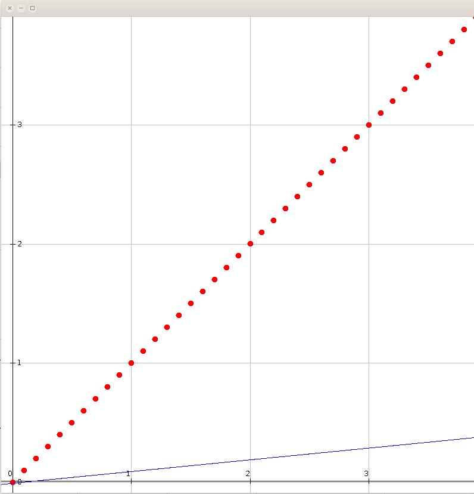

# Heuristic-algorithms
Generically implemented general heuristic algorithms

This repository offers a generic implementation of basic heuristic algorithms. There are two ideas behind this repository:

    to provide a high quality simple to use implementations which can be used for experiments and
    to serve as education material for all those interested in heuristic algorithms.

This project offers implementations of the following algorithms:
* Simulated annealing
* Local search
* Variable neighborhood descent
* Population based variable neighborhood descent

The project also provides several specific solvers:
* Knapsack solver
* Traveling salesman solver

## Use of the library
Since there are several different algorithms available we will not show how to use all of them, but will use the local search algorithm as a show case.
Let's say you wish to fit a linear function to a given dataset. 

In order to solve this problem you have decided to use the following strategies:
* SOLUTION REPRESENTATION: double array,
* SOLUTION QUALITY: one divided by function value,
* STOPPING CONDITIONS: function value close to 0, number of function evaluations
* NEIGHBORHOOD: Uniform delta coordinate change

You would do this in the following way:
```java
double delta = 0.05;
double acceptableErrorRate = 10e-6;
int maximumNumberOfGenerations = 1_000_000;

//Function to optimize
LinearFunction linearFunction = new LinearFunction();
double[][] systemMatrix = DataSetLoader.loadMatrix(new File(System.getProperty("user.dir"),"data/algorithm-examples/linear-data.txt"));
FunctionCallCounterWrapper<double[]> function =  new FunctionCallCounterWrapper<double[]>(
    new PrototypeBasedSystemLossFunction(systemMatrix,linearFunction,new SquareErrorFunction()));		

//Start solution
int variableNumber = linearFunction.getCoefficientCount();
DoubleArraySolution startSolution = new DoubleArraySolution(new double[variableNumber]);

//Decoder
IDecoder<DoubleArraySolution,double[]> decoder = new PassThroughDoubleDecoder();

//Fitness evaluator
IFitnessEvaluator<DoubleArraySolution> evaluator = new ThroughOneFitnessEvaluator(new FunctionValueFitnessEvaluator());

//Optimization stopper
IOptimisationStopper<DoubleArraySolution> stopper = new CompositeOptimisationStopper<>(Arrays.asList(
  new FunctionValueStopper<>(acceptableErrorRate),
  new GenerationNumberEvolutionStopper<>(maximumNumberOfGenerations)
));

//Neighborhood
double[] deltas = new double[variableNumber];
Arrays.fill(deltas, delta);
INeighborGenerator<DoubleArraySolution> neighborhood = new DoubleArrayUnifNeighborhood(deltas);

//Optimization
IOptimizationAlgorithm<DoubleArraySolution> optimizationAlgorithm = 
    new GreedyAlgorithm<double[],DoubleArraySolution>(decoder, neighborhood, evaluator, stopper, function, startSolution);

DoubleArraySolution solution = optimizationAlgorithm.run();
```

## Examples
In the examples source folder you can find several usage examples.

